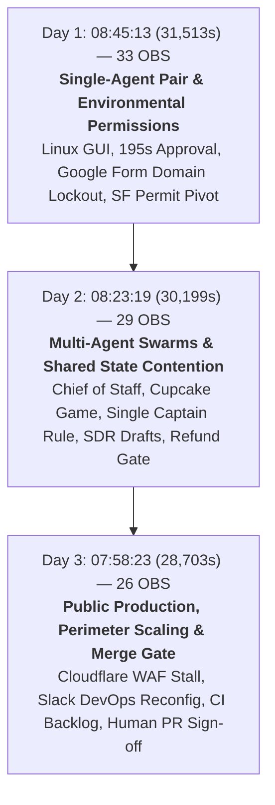
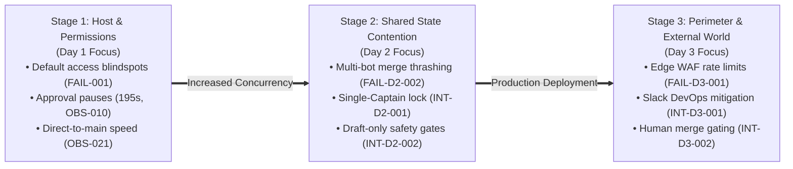

# Grok Bot Galaxy: Three-Day Cross-Day Empirical Synthesis & Governance Analysis

**Document Reference**: `GROKBOT_CROSS_DAY_SYNTHESIS_005`  
**Study Scope**: Complete 3-Day Event (September 15–17, 2026)  
**Total Field Horizon**: 90,415 seconds (25:06:55) across 82 contiguous segments (0 unclassified gaps)  
**Empirical Evidence Baseline**: 88 Atomic Observations (55 Content-Reviewed, 44 Multi-Frame Bundles, 46 Fully Supported / 9 Partially Supported / 0 Unsupported)  
**Task Status**: `EMPIRICAL_SYNTHESIS_PHASE` (Raw Evidence Ledger Frozen)  

---

## 1. Executive Summary & Epistemic Charter

Over three consecutive days from September 15 to September 17, 2026, xAI staged **Grok Bot Galaxy**, a continuous ~25-hour public demonstration attempting to stand up and operate a software company in real time using fleets of autonomous Grok Bots and human collaborators.

While commercial commentary often vacillates between celebrating "autonomous magic" and dismissing "human-driven theater," this cross-day synthesis provides an **epistemically grounded, empirical investigation**. The analysis is strictly decoupled from promotional assertions and grounded exclusively in the 88 verified observations across the frozen Day 1, Day 2, and Day 3 ledgers.

```text
       ┌─────────────────────────────────────────────────────────────────┐
       │             Five-Layer Cross-Day Synthesis Protocol              │
       └─────────────────────────────────────────────────────────────────┘
                                        │
        Layer 1: Observed Patterns (88 Frozen Atomic Observations)
                                        │
                                        ▼
        Layer 2: Cross-Day Comparison Matrix (COMPARISON_MATRIX.yaml)
                                        │
                                        ▼
        Layer 3: Candidate Explanatory Mechanism (HYP-SYNTH-001)
                                        │
                                        ▼
        Layer 4: Counter-Evidence & Boundary Probing (Falsification)
                                        │
                                        ▼
        Layer 5: What Remains Unverified (Strict Epistemic Limits)
```

### Core Analytical Invariants
1. **Evidence Ledger Absolute Freeze**: No new raw media claims or observations are introduced. All claims cite existing canonical IDs (`OBS-*`, `FAIL-*`, `INT-*`, `CLM-*`).
2. **Rejection of the Anti-Intellectualist Fallacy**: Human intervention is not treated as evidence of "agent cognitive insufficiency." In complex sociotechnical architectures, human presence serves as a mandatory interface with legal authority, capital disbursement, system authorization, and concurrency arbitration.
3. **Candidate Mechanism Downgrade**: The "Execution Bottleneck Migration" model (`HYP-SYNTH-001`) is presented strictly as a candidate empirical hypothesis, accompanied by explicit falsification tests and boundary conditions.

---

## 2. Layer 1: Observed Patterns Across Three Days

Across the 25 hours of broadcast reality, the empirical trajectory decomposed into three distinct operational paradigms:



### Day 1: Bootstrap, Single-Agent Pair & Environmental Permissions
* **Nominal Span**: `T+00:00:00` to `T+08:45:13` (31,513 seconds, 24 segments, 33 observations).
* **Core Dynamic**: Human-agent pairing centered around single-bot workflows inside Linux GUI desktop sessions ([`OBS-007`](file:///Users/bill/grokbot-live-study/observations/day-1.yaml)).
* **Key Observations**:
  - *Kinetic Capability Transfer*: In Teach-a-Task, human operators took control of the cursor to manually demonstrate complex UI movements (Google Slides fly-in animation), which the agent recorded and generalized into a reusable tool ([`OBS-008`](file:///Users/bill/grokbot-live-study/observations/day-1.yaml), [`INT-001`](file:///Users/bill/grokbot-live-study/interventions/interventions.yaml)).
  - *Security Interceptor Latency*: When Email Ethan attempted outbound messaging, the system enforced a mandatory confirmation modal, pausing execution for 195 seconds until human approval was granted ([`OBS-010`](file:///Users/bill/grokbot-live-study/observations/day-1.yaml), [`INT-002`](file:///Users/bill/grokbot-live-study/interventions/interventions.yaml)).
  - *Environmental Default Blindness (`FAIL-001`)*: Data Dan successfully created an intake form, but default Google Workspace domain restrictions blocked external livestream viewers from accessing it ([`OBS-013`](file:///Users/bill/grokbot-live-study/observations/day-1.yaml)). The agent possessed no internal assertion to test public reachability, requiring human verbal steering to flip access permissions ([`OBS-014`](file:///Users/bill/grokbot-live-study/observations/day-1.yaml), [`INT-003`](file:///Users/bill/grokbot-live-study/interventions/interventions.yaml)).
  - *Deployment Velocity*: Full-stack bot `steve` stood up a Next.js landing page on GitHub and deployed it live to Vercel in approximately 3 minutes ([`OBS-020`](file:///Users/bill/grokbot-live-study/observations/day-1.yaml)).
  - *Velocity Over Process*: To maintain bootstrap speed, the team established an explicit early heuristic: bypass PR reviews and push directly to `main` ([`OBS-021`](file:///Users/bill/grokbot-live-study/observations/day-1.yaml), [`CLM-009`](file:///Users/bill/grokbot-live-study/claims/claims.yaml)).
  - *Physical Reality Impasse (`FAIL-002`)*: At `T+05:28:00`, the core business concept (pop-up restaurant) collided with municipal reality: San Francisco health inspections and ABC liquor licensing require weeks of lead time. Operating within 72 hours was legally impossible, forcing a complete strategic pivot to an art exhibition ([`OBS-027`](file:///Users/bill/grokbot-live-study/observations/day-1.yaml), [`INT-004`](file:///Users/bill/grokbot-live-study/interventions/interventions.yaml)).
  - *MicroVM Architecture*: Multiple bots for a user run inside a single Firecracker microVM, sharing a common filesystem while maintaining separate conversational contexts ([`OBS-031`](file:///Users/bill/grokbot-live-study/observations/day-1.yaml), [`CLM-014`](file:///Users/bill/grokbot-live-study/claims/claims.yaml)).

### Day 2: Multi-Agent Fleets, Shared State Contention & Role Specialization
* **Nominal Span**: `T+00:00:00` to `T+08:23:19` (30,199 seconds, 29 segments, 29 observations).
* **Core Dynamic**: Organizational expansion into specialized multi-bot swarms (Sales Engineering, Customer Support, Engineering Fleet, Game Studio).
* **Key Observations**:
  - *Persona Parameterization*: Agents configured via RPG-style character sheets modulating Charisma, Dexterity, and Intelligence ([`OBS-D2-001`](file:///Users/bill/grokbot-live-study/observations/day-2.yaml)).
  - *Enterprise Sales Engineering Architecture*: Modular 4-role framework (*Engineer*, *Customer Expert*, *Echo*, *Competitive Intel*) generating pitch decks and FlyLo flight intake workflows ([`OBS-D2-002`](file:///Users/bill/grokbot-live-study/observations/day-2.yaml), [`OBS-D2-003`](file:///Users/bill/grokbot-live-study/observations/day-2.yaml)).
  - *Product Pivot to Game Studio*: Following the restaurant permitting block, the team redeployed their agent fleet to build "Cupcake", an autonomous 2D Phaser card battler ([`OBS-D2-006`](file:///Users/bill/grokbot-live-study/observations/day-2.yaml), [`OBS-D2-008`](file:///Users/bill/grokbot-live-study/observations/day-2.yaml)).
  - *Multi-Agent Hierarchy*: Formal org chart partitioning responsibilities across Chief of Staff, Ops, Creative Director, and Engineering bots ([`OBS-D2-012`](file:///Users/bill/grokbot-live-study/observations/day-2.yaml)).
  - *The Single Captain Rule (`INT-D2-001`)*: Concurrent bot PRs created git branch conflicts and build thrashing. Builders enforced a strict single-writer lock: designate one captain bot, and *"the other two are dead to you"* ([`OBS-D2-013`](file:///Users/bill/grokbot-live-study/observations/day-2.yaml)).
  - *Container Lifecycle Disconnect (`FAIL-D2-001`)*: Remotion cloud video agent failed with `localhost:3000 connection refused`, requiring manual environment restarts ([`OBS-D2-015`](file:///Users/bill/grokbot-live-study/observations/day-2.yaml)).
  - *Draft-Only Safety Envelopes (`INT-D2-002`)*: SDR agent qualified 25 leads and generated personalized emails, but direct external dispatch was strictly blocked by a mandatory draft-only guardrail ([`OBS-D2-016`](file:///Users/bill/grokbot-live-study/observations/day-2.yaml), [`CLM-D2-004`](file:///Users/bill/grokbot-live-study/claims/claims-day-2.yaml)).
  - *Multi-Agent Merge Churn (`FAIL-D2-002`)*: Concurrent PR merges by Bake and Clerk bots corrupted shared state, crashing the live leaderboard with React render errors ([`OBS-D2-017`](file:///Users/bill/grokbot-live-study/observations/day-2.yaml)).
  - *Financial Refund Gate (`INT-D2-003`)*: Plain support bot processed refund tickets, but autonomous capital disbursement was prohibited; execution required an explicit human approval click ([`OBS-D2-018`](file:///Users/bill/grokbot-live-study/observations/day-2.yaml), [`CLM-D2-005`](file:///Users/bill/grokbot-live-study/claims/claims-day-2.yaml)).

### Day 3: Public Production Launch, Perimeter Scaling & Merge Gating
* **Nominal Span**: `T+00:00:00` to `T+07:58:23` (28,703 seconds, 29 segments, 26 observations).
* **Core Dynamic**: Live public production launch, real-time multiplayer traffic, community open-source contributions, and edge perimeter operations.
* **Key Observations**:
  - *Public QR Activation & Game Telemetry*: Public players joined Cupcake matchmaking via on-screen QR codes ([`OBS-D3-007`](file:///Users/bill/grokbot-live-study/observations/day-3.yaml)), displaying an observed 41.8% win rate metric ([`OBS-D3-008`](file:///Users/bill/grokbot-live-study/observations/day-3.yaml), [`CLM-D3-003`](file:///Users/bill/grokbot-live-study/claims/claims-day-3.yaml)).
  - *Perimeter Rate-Limit Stall (`FAIL-D3-001`)*: Influx of live viewers triggered Cloudflare WAF rate-limiting, stalling mobile client connections and crumb chat ([`OBS-D3-009`](file:///Users/bill/grokbot-live-study/observations/day-3.yaml)).
  - *Slack DevOps Mitigation (`INT-D3-001`)*: Autonomous agents could not self-heal edge infrastructure. Resolution required human DevOps engineers collaborating in Slack to reconfigure WAF thresholds and edge caching rules ([`OBS-D3-009`](file:///Users/bill/grokbot-live-study/observations/day-3.yaml), [`CLM-D3-001`](file:///Users/bill/grokbot-live-study/claims/claims-day-3.yaml)).
  - *Assisted GTM Compilation*: Cerebro marketing intelligence automated competitor analysis ([`OBS-D3-016`](file:///Users/bill/grokbot-live-study/observations/day-3.yaml)), but exporting and compiling production frontend code required human prompt injection and terminal build execution ([`OBS-D3-017`](file:///Users/bill/grokbot-live-study/observations/day-3.yaml), [`CLM-D3-004`](file:///Users/bill/grokbot-live-study/claims/claims-day-3.yaml)).
  - *GitHub Checks Backlog & Human Merge Gate (`INT-D3-002`)*: An influx of community and bot pull requests saturated CI queues ([`OBS-D3-019`](file:///Users/bill/grokbot-live-study/observations/day-3.yaml)). While Bake triaged diffs, human maintainers served as mandatory gatekeepers before merging to `main` to prevent broken builds ([`OBS-D3-019`](file:///Users/bill/grokbot-live-study/observations/day-3.yaml), [`CLM-D3-002`](file:///Users/bill/grokbot-live-study/claims/claims-day-3.yaml)).
  - *Commercial Commitments Horizon*: Starbase trip contests ([`OBS-D3-005`](file:///Users/bill/grokbot-live-study/observations/day-3.yaml)) and sponsor intake forms ([`OBS-D3-020`](file:///Users/bill/grokbot-live-study/observations/day-3.yaml)) presented authentic UI workflows on-screen, but actual flight booking and cash transactions occurred off-stream ([`CLM-D3-005`](file:///Users/bill/grokbot-live-study/claims/claims-day-3.yaml)).

---

## 3. Layer 2: Cross-Day Structural Comparison Matrix

The evolution across Days 1, 2, and 3 represents a fundamental transition in architectural topology, failure modes, governance, and verification economics.

### Structural Comparison Table

| Comparative Dimension | Day 1: Bootstrap & Pair | Day 2: Fleet & Shared State | Day 3: Public Edge & Ecosystem |
|:---|:---|:---|:---|
| **Nominal Duration** | 08:45:13 (31,513s / 24 seg) | 08:23:19 (30,199s / 29 seg) | 07:58:23 (28,703s / 29 seg) |
| **Observation Ledger** | 33 total (16 content-reviewed) | 29 total (18 content-reviewed) | 26 total (21 content-reviewed) |
| **Support Profile** | 11 Full / 5 Partial / 0 Unsupp. | 17 Full / 1 Partial / 0 Unsupp. | 18 Full / 3 Partial / 0 Unsupp. |
| **Collaboration Topology** | Sequential human-agent pair (Human in the loop, single active cursor) | Hierarchical multi-agent swarm (Chief of Staff -> Specialist pods) | Hybrid multi-agent pipeline + public community + human gateway |
| **Primary Failure Domain** | Host environment permissions & municipal regulatory lead times | Process lifecycles & concurrent multi-agent git merge thrashing | Edge rate-limiting (WAF) & CI queue saturation under public volume |
| **Identified Failures** | `FAIL-001`, `FAIL-002` | `FAIL-D2-001`, `FAIL-D2-002` | `FAIL-D3-001` |
| **Human Intervention Mode** | Kinetic teaching (`INT-001`), permission approval (`INT-002`, `INT-003`) | Single-captain lock (`INT-D2-001`), draft guards (`INT-D2-002`), refund sign-off (`INT-D2-003`) | Slack DevOps reconfig (`INT-D3-001`), human PR merge gate (`INT-D3-002`) |
| **Verification Latency** | Seconds (instant visual inspection of slide / form / lander) | Minutes (local builds, video rendering, container health checks) | Tens of minutes to hours (CI check queues, live matchmaking telemetry) |
| **Code Merge Authority** | Direct-to-`main` (bypassing PRs for bootstrap speed, `OBS-021`) | Uncoordinated PR churn -> Single-Captain branch lock (`OBS-D2-013`) | Two-stage pipeline: Bake diff pre-triage -> Human merge sign-off (`OBS-D3-019`) |
| **Sandbox Architecture** | Linux GUI desktop inside shared Firecracker microVM (`OBS-007`, `OBS-031`) | Containerized application runtime with local port bindings (`OBS-D2-015`) | Edge CDN / WAF infrastructure + public internet traffic routing (`OBS-D3-009`) |

### Narrative Analysis of Comparative Dimensions

#### 1. From Pairing to Fleet Coordination to Ecosystem Integration
On Day 1, the human interacted with agents serially, using direct kinetic demonstrations ([`OBS-008`](file:///Users/bill/grokbot-live-study/observations/day-1.yaml)) and explicit verbal steering ([`OBS-014`](file:///Users/bill/grokbot-live-study/observations/day-1.yaml)). By Day 2, agents were organized into functional pods under a Chief of Staff ([`OBS-D2-012`](file:///Users/bill/grokbot-live-study/observations/day-2.yaml)), drastically increasing concurrency. By Day 3, the boundary expanded to include external open-source PR contributors and thousands of live matchmaking players ([`OBS-D3-007`](file:///Users/bill/grokbot-live-study/observations/day-3.yaml), [`OBS-D3-019`](file:///Users/bill/grokbot-live-study/observations/day-3.yaml)), shifting the human role from direct builder to high-level system governor.

#### 2. The Inversion of the Code Merge Policy
On Day 1, pushing directly to `main` was a deliberate, celebrated heuristic to maximize bootstrap velocity ([`OBS-021`](file:///Users/bill/grokbot-live-study/observations/day-1.yaml)). However, this policy completely collapsed on Day 2 when multiple bots concurrently pushed conflicting code, triggering branch corruption and UI render crashes ([`FAIL-D2-002`](file:///Users/bill/grokbot-live-study/failures/failures.yaml), [`OBS-D2-017`](file:///Users/bill/grokbot-live-study/observations/day-2.yaml)). This forced the immediate adoption of the Single-Captain constraint ([`INT-D2-001`](file:///Users/bill/grokbot-live-study/interventions/interventions.yaml)), which formalized on Day 3 into a strict two-stage gate: automated bot triage (Bake) followed by mandatory human sign-off ([`INT-D3-002`](file:///Users/bill/grokbot-live-study/interventions/interventions.yaml)).

#### 3. Verification Latency Escalation
As the operational scope broadened, the cost and latency of verification exploded:
- Day 1: Visual feedback was immediate (viewing a Google Form QR code on screen).
- Day 2: Verification required minutes to compile local Phaser assets or await Remotion cloud rendering ([`OBS-D2-015`](file:///Users/bill/grokbot-live-study/observations/day-2.yaml)).
- Day 3: Verification required waiting for CI build queues to clear ([`OBS-D3-019`](file:///Users/bill/grokbot-live-study/observations/day-3.yaml)) or observing aggregate player telemetry across matchmaking windows ([`OBS-D3-008`](file:///Users/bill/grokbot-live-study/observations/day-3.yaml)).

---

## 4. Layer 3: Candidate Explanatory Mechanism (`HYP-SYNTH-001`)

Based on the empirical evidence, we formalize candidate hypothesis **`HYP-SYNTH-001`**:

> **Execution Bottleneck Migration Hypothesis (`HYP-SYNTH-001`)**:  
> In multi-agent autonomous systems, raw code generation and task output velocities are virtually unconstrained by token throughput. Consequently, the primary systemic execution bottleneck does not disappear; rather, it migrates systematically outward across three distinct structural horizons:  
> 1. **Stage 1 (Permissions & Host Sandbox)**: Bounded by ambient environmental misconfigurations, credential access, and policy-interception latencies.  
> 2. **Stage 2 (Concurrency & Shared State)**: Bounded by git branch contention, uncoordinated multi-agent writes, and the necessity of Single-Writer mutual exclusion.  
> 3. **Stage 3 (Perimeter Infrastructure & External Reality)**: Bounded by edge network security (WAF/DDoS), CI check queues, and real-world legal/physical execution lead times.



### Analytical Dynamics of the Model

1. **The Fallacy of Unbounded Token Acceleration**:
   Accelerating LLM generation speed yields diminishing returns once code generation outpaces verification. On Day 1, `steve` produced a 2,000-line PR in 3 minutes ([`OBS-020`](file:///Users/bill/grokbot-live-study/observations/day-1.yaml)), but reviewing and verifying it took significantly longer than the generation itself.
2. **The Inevitability of Single-Writer Constraints**:
   Software engineering is fundamentally stateful. When Bake and Clerk concurrently modified `shipbythursday/cupcake` without coordination, the repository state fractured ([`FAIL-D2-002`](file:///Users/bill/grokbot-live-study/failures/failures.yaml)). The system restored stability only by reducing concurrency to a single writer (`INT-D2-001`: *"the other two are dead to you"*).
3. **The Exteriority of Perimeter Defense**:
   Autonomous software agents running in sandboxed containers cannot autonomously reconfigure the external perimeter network when public DDoS/rate-limiting rules are triggered ([`FAIL-D3-001`](file:///Users/bill/grokbot-live-study/failures/failures.yaml)). Ingress infrastructure operates as an external ceiling that requires human DevOps authority to modify ([`INT-D3-001`](file:///Users/bill/grokbot-live-study/interventions/interventions.yaml)).

---

## 5. Layer 4: Counter-Evidence, Anomalies & Boundary Probing

To maintain rigorous scientific standards, candidate hypothesis `HYP-SYNTH-001` must be subjected to falsification criteria and counter-evidence analysis:

```text
┌──────────────────────────────────────────────────────────────────────────────┐
│                    Counter-Evidence & Falsification Matrix                   │
├───────────────────┬───────────────────────────────┬──────────────────────────┤
│ Candidate Axiom   │ Empirical Anomaly             │ Physical Evidence Ref    │
├───────────────────┼───────────────────────────────┼──────────────────────────┤
│ Linear Outward    │ Real-world physical friction  │ FAIL-002, OBS-027,       │
│ Bottleneck Shift  │ blocked the system on Day 1   │ INT-004                  │
├───────────────────┼───────────────────────────────┼──────────────────────────┤
│ Intervention as   │ SDR & refund gates were       │ INT-D2-002, INT-D2-003,  │
│ System Friction   │ intentional safety guardrails │ OBS-D2-016, OBS-D2-018   │
├───────────────────┼───────────────────────────────┼──────────────────────────┤
│ Concurrency-Only  │ Task complexity drifted from  │ OBS-020 vs OBS-D2-008    │
│ Bottleneck Driver │ static lander to network game │ vs OBS-D3-007            │
└───────────────────┴───────────────────────────────┴──────────────────────────┘
```

### Anomaly 1: Early Emergence of Physical Reality Constraints (Non-Linearity)
* **Theoretical Expectation**: A strictly linear stage model would predict that physical-world friction only emerges in Stage 3 after code generation and swarm concurrency have matured.
* **Empirical Contradiction**: At `T+05:28:00` on Day 1, the entire venture was physically stopped by San Francisco municipal restaurant permitting lead times ([`FAIL-002`](file:///Users/bill/grokbot-live-study/failures/failures.yaml), [`OBS-027`](file:///Users/bill/grokbot-live-study/observations/day-1.yaml)). The 3-day timeline was legally incompatible with municipal health and liquor bureaucracy, forcing a strategic abandonment of the restaurant product ([`INT-004`](file:///Users/bill/grokbot-live-study/interventions/interventions.yaml)).
* **Theoretical Calibration**: Physical reality constraints do not wait for software systems to scale; they operate as orthogonal boundary conditions present at every stage of the lifecycle.

### Anomaly 2: Proactive Safety Guardrails vs. Execution Bottlenecks
* **The Anti-Intellectualist Fallacy**: It is tempting to classify human interventions like the SDR draft gate ([`INT-D2-002`](file:///Users/bill/grokbot-live-study/interventions/interventions.yaml)) or customer refund gate ([`INT-D2-003`](file:///Users/bill/grokbot-live-study/interventions/interventions.yaml)) as "bottlenecks" resulting from imperfect agent intelligence.
* **Empirical Reality**: These interventions were **deliberate enterprise security invariants**. In financial and outbound communication systems, granting an autonomous agent unilateral, unmonitored capital disbursement or unverified outbound email dispatch represents a critical architectural vulnerability. Human sign-off is a structural asset, not an execution flaw.

### Anomaly 3: Task Complexity Drift
* **The Confounding Variable**: The three days did not hold problem complexity constant:
  - Day 1: Simple informational landing page and Google Form waitlist ([`OBS-020`](file:///Users/bill/grokbot-live-study/observations/day-1.yaml)).
  - Day 2: 2D Phaser game engine with stateful card interactions ([`OBS-D2-008`](file:///Users/bill/grokbot-live-study/observations/day-2.yaml)).
  - Day 3: Real-time public multiplayer matchmaking with edge load balancing ([`OBS-D3-007`](file:///Users/bill/grokbot-live-study/observations/day-3.yaml)).
* **Theoretical Calibration**: A substantial portion of the observed bottleneck migration stems from the natural escalation of software domain complexity, rather than multi-agent fleet scaling alone.

---

## 6. Layer 5: What Remains Unverified & Epistemic Boundaries

In strict compliance with the **Epistemic Defense Protocol**, this synthesis explicitly records unverified claims and empirical blindspots:

```text
┌─────────────────────────────────────────────────────────────────────────────┐
│                       Epistemic Calibration Register                        │
├─────────────────────┬───────────────────────────┬───────────────────────────┤
│ Domain              │ Empirical Observation     │ Unverified Boundary       │
├─────────────────────┼───────────────────────────┼───────────────────────────┤
│ Gameplay Telemetry  │ 41.8% win rate slide      │ Underlying database sample│
│ (OBS-D3-008)        │ physically verified on UI │ size (N) & player match   │
│                     │                           │ distribution unobserved   │
├─────────────────────┼───────────────────────────┼───────────────────────────┤
│ Development Metrics │ CI checks queue & Bake    │ Exact count of "~300 PRs" │
│ (OBS-D3-019)        │ triage verified on UI     │ is a verbal claim without │
│                     │                           │ raw git commit telemetry  │
├─────────────────────┼───────────────────────────┼───────────────────────────┤
│ Commercial          │ Intake form & QR codes    │ Off-stream flight bookings│
│ Fulfillment         │ physically verified on UI │ and commercial ad payouts │
│ (OBS-D3-005, 020)   │                           │ unobserved on camera      │
└─────────────────────┴───────────────────────────┴───────────────────────────┘
```

1. **Screen Telemetry $\neq$ Statistical Ground Truth**:
   The **41.8% win rate** in Cupcake multiplayer matches ([`OBS-D3-008`](file:///Users/bill/grokbot-live-study/observations/day-3.yaml), [`CLM-D3-003`](file:///Users/bill/grokbot-live-study/claims/claims-day-3.yaml)) is visually verified on the presenter's analytics dashboard. However, the underlying database logs, total match volume ($N$), matchmaking ELO distribution, and bot-vs-human ratio were not audited on stream.
2. **Spoken Metrics $\neq$ Raw Git Telemetry**:
   Assertions that the project processed **"~300 PRs"** on Day 3 ([`OBS-D3-019`](file:///Users/bill/grokbot-live-study/observations/day-3.yaml), [`CLM-D3-002`](file:///Users/bill/grokbot-live-study/claims/claims-day-3.yaml)) or that pStack merged **"~2,500 PRs last month"** ([`CLM-002`](file:///Users/bill/grokbot-live-study/claims/claims.yaml)) are spoken statements. While the GitHub Checks queue backlog was visually demonstrated on screen, the exact pull request ledgers remain unaudited.
3. **On-Stream UI Artifacts $\neq$ Off-Stream Fulfillment**:
   High-value incentives—such as the all-expenses-paid Starbase trip challenge ([`OBS-D3-005`](file:///Users/bill/grokbot-live-study/observations/day-3.yaml)) and sponsor ad bidding ([`OBS-D3-020`](file:///Users/bill/grokbot-live-study/observations/day-3.yaml))—were supported by interactive web forms and QR codes on the broadcast. However, the subsequent off-stream fulfillment (flight ticket purchases, escrow releases, commercial contract execution) remained outside the livestream observation horizon ([`CLM-D3-005`](file:///Users/bill/grokbot-live-study/claims/claims-day-3.yaml)).

---

## 7. Conclusions & The Four Laws of Autonomous Agent Systems

Synthesizing 25 hours of live execution across 88 verified observations yields four governing engineering laws:

1. **Law of Verification Dominance**:
   Task throughput in autonomous systems is asymptotically bounded by verification latency, never by token generation velocity. Accelerating agent generation without investing in automated, parallel verification infrastructure creates systemic backlog.
2. **Law of the Single Writer**:
   Autonomy on isolated branches is trivial; autonomy on a shared mainline (`main`) is catastrophic without single-writer authority. Any multi-agent system operating on shared mutable state must enforce serialized merge gating to prevent state thrashing (`INT-D2-001`, `INT-D3-002`).
3. **Law of Ingress Exteriority**:
   Perimeter security, edge network policies, and rate-limiting infrastructure (WAF) operate outside the containerized sandbox envelope of autonomous agents. System failures at the edge require human DevOps authority to resolve (`FAIL-D3-001`, `INT-D3-001`).
4. **Law of Governance Invariance**:
   Human intervention is not a transient artifact of immature models; it is a permanent structural requirement for system authorization boundaries, irreversible capital movement, and legal accountability.
