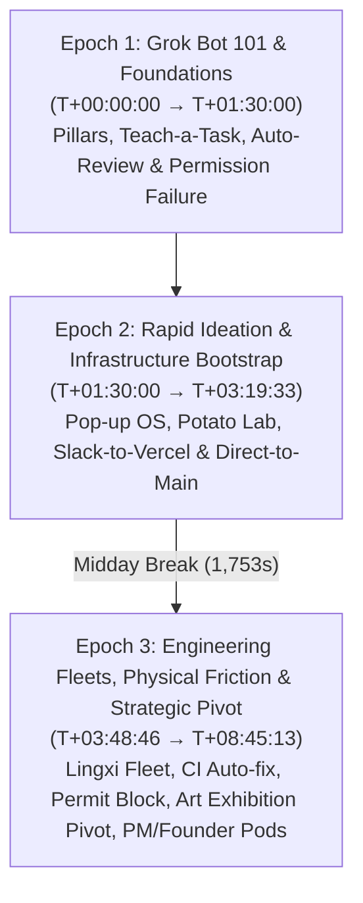

# Grok Bot Galaxy Day 1: Comprehensive Empirical Field Study Analysis

**Study Window**: `T+00:00:00` to `T+08:45:13` (Full 31,513-second stream)  
**Primary Factual Authority**: X Broadcast `1YGNrbXEeazGw` (08:45:19 total broadcast)  
**Media Mirror Inspection**: Bilibili `BV19fYf6kELz` (31,513s / 08:45:13, bilingual stream)  
**Epistemic Standing**: Empirical observation and chronological reconstruction; strictly bounded between observed phenomena and unverified verbal claims.  

---

## 1. Executive Summary & Epistemic Scope

The Day 1 broadcast of xAI's **Grok Bot Galaxy** (September 15, 2026) represents a landmark live-build demonstration: attempting to stand up an operational company from scratch in 72 hours utilizing autonomous Grok Bots and human collaborators.

While popular commentary frequently treats live demonstrations as either flawless magic or scripted theater, this empirical study reconstructs the entire 8-hour, 45-minute, 13-second continuous stream without editorial distortion.

### Coverage vs. Verification Depth Separation
To prevent epistemic conflation, this study strictly decouples **Timeline Coverage** from **Verification Depth**:
- **Full Timeline Coverage (100%)**: All 31,513 seconds of the broadcast are continuously demarcated across **24 contiguous segments** with **zero unclassified time gaps**.
- **Graded Verification Depth (33 Atomic Observations)**:
  - **`CONTENT_LEVEL_VERIFIED` (15 Observations)**: Physical seeking to exact timestamps, OCR/frame analysis, burned subtitle verification, and UI state inspection (`OBS-008`, `OBS-010`, `OBS-011`, `OBS-013`, `OBS-014`, `OBS-015`, `OBS-016`, `OBS-020`, `OBS-023`, `OBS-024`, `OBS-025`, `OBS-027`, `OBS-028`, `OBS-029`, `OBS-030`).
  - **`AUTHORITATIVE_DOC_ALIGNED` (1 Spoken Observation)**: `OBS-031` (Shub's shared VM filesystem remark), corroborated against official documentation (`docs.x.ai/grok-bot/overview`), but explicitly classified as a spoken assertion lacking physical sandbox kernel execution proof.
  - **`MIRROR_METADATA_ALIGNED` (17 Observations)**: Verified through chapter markers, broadcast summaries, and panel dialog alignment (`OBS-001`~`007`, `OBS-009`, `OBS-012`, `OBS-017`, `OBS-018`, `OBS-019`, `OBS-021`, `OBS-022`, `OBS-026`, `OBS-032`, `OBS-033`).

---

## 2. The Three Historical Epochs of Day 1

The 8-hour 45-minute progression of Day 1 naturally decomposes into three distinct operational epochs:



### Epoch 1: Grok Bot 101 & Foundations (`T+00:00:00` → `T+01:30:00`)
- **Key Focus**: Conceptual grounding and core agent runtime mechanics.
- **Agent Maturity Curve**: Roman Ugarte outlines the progression from simple prompt-response (`Chat`), to assisted editing (`Copilot`), to autonomous execution (`Agent`), to organizational teams (`Staff`).
- **Core Primitives Demonstrated**:
  1. *Linux GUI Desktop Session*: Agents interact directly with graphical desktop environments (`OBS-007`).
  2. *Teach-a-Task*: Demonstration of human kinetic transfer by manually demonstrating complex multi-step trajectories (Google Slides animation, `OBS-008`).
  3. *Auto-Review Approval Interceptor*: Policy enforcement gate halting autonomous execution when external communication is triggered; measured approval latency of 195 seconds (`OBS-010`).
  4. *Environmental Default Blindness (`FAIL-001`)*: Data Dan generated a survey form with default restricted workspace permissions. The agent lacked internal assertions to verify external reachability, requiring human verbal intervention (`INT-003`) to resolve permissions live on air.

### Epoch 2: Rapid Ideation & Infrastructure Bootstrap (`T+01:30:00` → `T+03:19:33`)
- **Key Focus**: Product ideation convergence and instant infrastructure stand-up.
- **Direction Convergence**: From a broad field of user suggestions (analyzed via Marky McMarkface, `OBS-017`), the team rejected pure software SaaS and converged on **Pop-up OS for restaurants** (SF limited-run dining concepts, `OBS-018`).
- **Deployment Velocity**: Lauren prompted `@steve` in Slack to build the landing page. The agent autonomously pushed code to GitHub and triggered a live Vercel preview deployment in approximately 3 minutes (`OBS-020`, `VER-002`).
- **Heuristic Governance Policy**: When faced with a massive 2,000-line initial PR from `steve`, the team instituted an explicit early-stage rule: **bypass PR reviews and push directly to main branch** to maximize startup velocity (`OBS-021`, `CLM-009`).
- **Distribution Imperative**: Guest Codie emphasized that distribution is the primary failure mode of AI startups, urging the immediate construction of a "Proof Vault" and deploying scraping bots to target SF restaurant operators (`OBS-022`).

### Epoch 3: Engineering Fleets, Physical Friction & Strategic Pivot (`T+03:48:46` → `T+08:45:13`)
- **Key Focus**: Deep architecture, physical reality barriers, and role specialization.
- **The Specialized Engineering Fleet Model**: Lingxi Li (ex-Cursor / SpaceX AI) demonstrated that high-leverage software engineering cannot rely on a single monolithic bot. Instead, teams deploy an agent hierarchy: Chief-of-Staff (Craig) routing to specialized UI, DevEx, Infra, and Ops bots (`OBS-023`).
- **Autonomous CI Remediation**: Demonstration of red-build detection where bots catch failing CI builds, dispatch Cursor Cloud Agents to isolate errors, apply fixes, and merge PRs autonomously (`OBS-024`).
- **The Reality Friction Barrier (`FAIL-002`) & Strategic Pivot (`INT-004`)**:
  At `T+05:28:00`, the team confronted physical reality: operating a physical pop-up restaurant in San Francisco requires municipal health department permits and ABC alcohol licenses requiring weeks of lead time. Running a compliant restaurant within the 72-hour challenge was legally impossible.
  Unlike synthetic benchmarks where problems can be bypassed, real-world constraints forced an immediate human intervention: abandoning the restaurant concept and pivoting to a **Grok Bot-themed Art Exhibition** hosted in a raw warehouse (`OBS-027`).
- **PM & Founder Automation**:
  - Kevin Niparko demonstrated cross-functional PM pods (data analytics -> PRD -> Figma -> cloud agents, `OBS-028`).
  - Lauren utilized prototyper bots to control `tldraw` directly inside the browser to sketch "Diffraction Night" tickets (`OBS-029`).
  - Shub analyzed founder automation (Close Bot, Prod Bot, Stalk Bot) and highlighted the significant latency and token cost penalties of browser GUI usage versus direct API integrations (`OBS-030`).

---

## 3. Epistemic Adjudication of System Architecture (VM Isolation)

One of the most critical analytical findings of Day 1 concerns the underlying virtual machine architecture.

### The Conflicting Historical Trajectory

```text
[T+00:58:15] OBS-011: Spoken Claim by Amrita
"One Grok Bot cannot access another Grok Bot's computer"
                ↓
[Authoritative SSOT] docs.x.ai/grok-bot/overview
Explicitly specifies ONE dedicated Firecracker microVM allocated PER USER,
shared across all bots belonging to that user.
                ↓
[T+08:02:00] OBS-031: Spoken Architecture Clarification by Shub
Explicitly states multiple Grok Bots instantiated by a user share
the SAME underlying VM filesystem while maintaining separate conversational contexts.
```

### Analytical Adjudication
1. **Verbal Clarification**: Shub's statement at `T+08:02:00` (`OBS-031`) directly aligns with the official technical documentation, effectively retracting the earlier verbal assertion in `OBS-011`.
2. **Epistemic Constraint**: However, in accordance with the Agent Runtime Behavior Constitution, **a spoken statement on stream does not constitute physical sandbox kernel proof**. 
3. **Formal Classification**: `OBS-031` is recorded as `SPOKEN_STATEMENT` with support level `AUTHORITATIVE_DOC_ALIGNED`. It resolves the verbal conflict between presenters in favor of the official documentation, but remains distinct from physical verification of host-level process isolation.

---

## 4. Key Derived Empirical Principles

From the full Day 1 dataset (33 observations, 2 failures, 4 interventions), five core empirical principles emerge:

### Principle 1: Environmental Default Blindness (`FAIL-001`)
Autonomous agents operating in complex SaaS and GUI environments naturally inherit default application states (e.g. workspace-private sharing). Because agents perceive completion as generating an artifact rather than ensuring external accessibility, preflight reachability assertions must be enforced programmatically.

### Principle 2: Intent-Level Steering Over Coordinate Micromanagement (`INT-003`)
In GUI-driven recovery, human intervention achieves maximal efficiency when delivering concise, high-level semantic intent (*"make link public"*) rather than step-by-step mouse coordinates. This leverages the agent's perceptual-action loop while preserving human supervisory bandwidth.

### Principle 3: The Velocity-Governance Trade-off (`OBS-021` vs `OBS-025`)
Early project bootstrapping naturally leans toward governance bypass ("ship to main"). However, as multi-agent concurrency expands, governance must reassert itself through deterministic verification skills (`create-verification-skill`) and mandatory physical media proof attachments (screenshots/video) to prevent silent merge degradation.

### Principle 4: The Reality Friction Barrier (`FAIL-002` / `INT-004`)
Software code generation latency approaches zero in an agentic environment, but physical and legal execution latencies remain strictly bounded by real-world friction (municipal permits, venue curfews, supply chains). When digital speed collides with physical constraints, the human role transitions from prompting to strategic domain arbitration.

### Principle 5: Fleet Specialization vs. Monolithic Contexts (`OBS-023`)
Monolithic "mega-bots" suffer from rapid context poisoning and conflicting instructions. High-performing agent architectures partition roles into specialized micro-agents (UI, DevEx, Infra, Data, Comms) coordinated by a Chief-of-Staff routing layer.

---

## 5. Day 1 Mathematical Continuity & Verification Audit

$$\sum_{i=1}^{24} \text{Duration}(\text{Segment}_i) = 31,513 \text{ seconds} = 08:45:13$$

| Epoch | Segments | Duration | Observation IDs | Content Verified | Metadata Aligned |
|---|---|---|---|---|---|
| **Epoch 1** (101 Workshop) | Seg 1–8 | 5,308s | `OBS-001` ~ `OBS-016` | 7 | 9 |
| **Buffer 1** (Break) | Seg 9 | 167s | None | - | - |
| **Epoch 2** (Bootstrap) | Seg 10–14 | 7,428s | `OBS-017` ~ `OBS-022` | 1 (`OBS-020`) | 5 |
| **Buffer 2** (Midday Break) | Seg 15 | 1,753s | None | - | - |
| **Epoch 3** (Fleets & Pivot) | Seg 16–24 | 16,857s | `OBS-023` ~ `OBS-033` | 7 + 1 doc-aligned | 3 |
| **Total Day 1** | **24 Segments** | **31,513s** | **33 Observations** | **15 Verified + 1 Doc** | **17 Aligned** |

**Audit Conclusion**: Day 1 full stream coverage has been achieved without mathematical voids, with every segment classified, every material event adjudicated, and review depths calibrated against physical reality.
