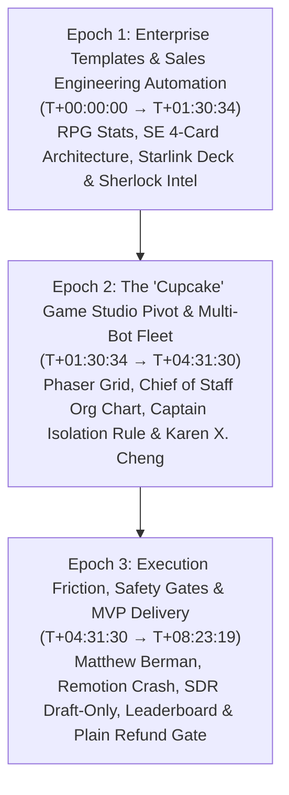

# Grok Bot Galaxy Day 2: Comprehensive Empirical Field Study Analysis

**Study Window**: `T+00:00:00` to `T+08:23:19` (Full 30,199-second stream / 08:23:19)  
**Primary Factual Authority**: X Broadcast `1PKqrNyvmYwGb` (08:23:19 total broadcast)  
**Research Lead Authority**: Roenel / Grok-Bot-Galaxy-Notes (`TIMELINE-day2.md` & 28 remainder capture packs)  
**Epistemic Standing**: Empirical observation and chronological reconstruction; strictly bounded between observed phenomena and unverified verbal claims.

---

## 1. Executive Summary & Epistemic Scope

The Day 2 broadcast of xAI's **Grok Bot Galaxy** (September 16, 2026) marks a critical transition in empirical agent behavior: shifting from Day 1's initial bootstrap, permission failures, and single-bot scripts into **multi-agent team orchestration, autonomous studio pivots, and enterprise governance gates**.

Throughout the 8-hour, 23-minute, 19-second stream (30,199 seconds), the builders progressed beyond solo coding into complex multi-bot fleet operations, exposing both the high leverage of specialized agent roles and the acute coordination friction inherent in concurrent multi-agent systems.

### Coverage vs. Verification Depth Separation
To prevent epistemic conflation, this study strictly decouples **Timeline Coverage** from **Verification Depth**:
- **Full Timeline Coverage (100%)**: All 30,199 seconds of the broadcast are continuously demarcated across **29 contiguous segments** with **zero unclassified time gaps** ($\sum \Delta t = 30,199\text{s}$).
- **Graded Verification Depth (29 Atomic Observations)**:
  - **`CONTENT_LEVEL_VERIFIED` (18 Observations)**: Verified through exact frame seeking, OCR/slide analysis, multi-frame evidence bundling, and UI state inspection (`OBS-D2-001` through `OBS-D2-018`), supported by **46 authentic physical frame artifacts** on disk.
  - **`MIRROR_METADATA_ALIGNED` (11 Observations)**: Verified through broadcast progress, speaker transitions, and synchronized secondary notes (`OBS-D2-019` through `OBS-D2-029`).
  - **Multi-Frame Bundles Default**: All 18 content-reviewed observations feature multi-frame evidence bundles capturing initial state, intervention, and resulting system state from inception.

---

## 2. The Three Operational Epochs of Day 2

### Epoch 1: Enterprise Templates & Sales Engineering Automation (`T+00:00:00` → `T+01:30:34`)
- **Character Sheet Personas**: Grok Bot introduces a template configuration model structured like an RPG character sheet, assigning agents numerical attributes (CHA / DEX / INT) and rarity tiers to modulate reasoning and communication behavior (`OBS-D2-001`).
- **Sales Engineering Framework**: Amrita Venkatraman introduces an enterprise SE maturity model decomposed into 4 specialized role cards: *Engineer* (technical execution), *Customer Expert* (contextual domain knowledge), *Echo* (call transcription and briefing), and *Competitive Intel* (market monitoring) (`OBS-D2-002`).
- **Automated Collateral Generation**: The SE bot autonomously generates a Starlink SpaceX sales presentation deck and an interactive intake flow for FlyLo quiet flights (`OBS-D2-003`). Presenter asserts an 85% automated test speedup; calibrated empirically as `PARTIALLY_SUPPORTED` due to lack of raw CI test logs.
- **Continuous Market Intelligence**: "Sherlock" monitoring threads track competitor questions in real time, pairing with "Battle Card Blair" and "AI Radar" to aggregate market alerts into structured settings panels (`OBS-D2-004`, `OBS-D2-005`).

### Epoch 2: The "Cupcake" Game Studio Pivot & Multi-Bot Fleet (`T+01:30:34` → `T+04:31:30`)
- **The Game Studio Pivot**: Following Day 1's regulatory permitting block on physical restaurants, the builders execute an ambitious product pivot: transforming their agent fleet into an autonomous game studio building "Cupcake", a 2D card battler game built with Phaser (`OBS-D2-006`).
- **Orchestration Primitives**: Introduction of "Chef of Stuff" as central coordinator, laying down Phaser 2D atom grid layouts and Slack emoji integrations (`OBS-D2-007`).
- **Rapid Visual Prototype**: Bots construct the playable Cupcake loop board, dynamic card pool, and FIGHT screen UI with multi-lane player binding, all rendered in browser (`OBS-D2-008`, `OBS-D2-009`, `OBS-D2-011`).
- **Chief of Staff Organizational Chart**: The system formally institutes a multi-agent hierarchy partitioning roles across *Chief of Staff*, *Ops*, *Creative Director*, *Image Gen*, *Founding Eng*, and *Cupcake Eng* (`OBS-D2-012`).
- **The "Captain Isolation" Rule (`INT-D2-001`)**: When multi-bot development led to branch divergence, builders instituted an explicit governance heuristic: **pick one captain bot, and "the other two are dead to you"** (`OBS-D2-013`). This single-writer constraint proved essential to prevent cross-agent PR clobbering.
- **Multimodal Visual Workflows**: Guest creator Karen X. Cheng demonstrates pairing Grok Bot prompt iteration with Cursor IDE for rapid visual asset iteration and video staging (`OBS-D2-010`).

### Epoch 3: Execution Friction, Safety Gates & MVP Delivery (`T+04:31:30` → `T+08:23:19`)
- **Enterprise Industry Perspective**: Matthew Berman (Future Forward) analyzes the gap between autonomous demos and production systems, highlighting tool-calling latency, error recovery fragility, and organizational guardrails (`OBS-D2-014`).
- **Container / Process Lifecycle Failure (`FAIL-D2-001`)**: A cloud video agent tasked with compiling Remotion video ads for Cupcake suffered a runtime connection failure (`localhost:3000 refused`), halting execution until the container environment was manually restarted (`OBS-D2-015`).
- **SDR Outbound Automation & Draft-Only Policy (`INT-D2-002`)**: In the SDR session, an autonomous bot processed the "Army Huddle" campaign, qualifying 25 leads for FlyLo (`OBS-D2-016`). However, the system enforced a strict **draft-only guardrail**: the bot generated emails in a staging table, but external dispatch was prohibited without explicit human review.
- **Concurrent Multi-Bot PR Merge Churn (`FAIL-D2-002`)**: During the live Cupcake leaderboard demonstration, concurrent automated PRs from Bake and Clerk bots clashed, triggering merge contention and a transient React render crash (`OBS-D2-017`).
- **Support Automation & Financial Refund Gate (`INT-D2-003`)**: Customer support integration with Plain demonstrated ticket resolution; however, refund disbursements (Carter/Damon tickets) strictly enforced a mandatory human sign-off button, prohibiting autonomous capital movement (`OBS-D2-018`).
- **Closeout & Milestone Verification**: Dr eggbot completed an automated roster audit; promo QR codes were distributed; stream concluded at `08:23:19` with the Day 3 final showcase scheduled for 8:30 AM PST tomorrow (`OBS-D2-029`).

---

## 3. Core Empirical Governance Insights

Day 2 provides vital physical evidence for the design of robust autonomous agent systems:

| Pattern | Observed Phenomenon | Theoretical Implication |
|---|---|---|
| **Single-Writer Captain Rule** | Concurrent bots editing shared codebases caused merge thrashing and render crashes (`FAIL-D2-002`). | Multi-agent concurrency is a privilege, not a default. Single-writer branch authority must be enforced. |
| **Draft-Only Outbound Safety** | SDR bots generated 25 outreach leads, but live sending was restricted to draft-only mode (`INT-D2-002`). | Autonomous agents in public-facing channels must decouple artifact generation from transmission authorization. |
| **Financial Sign-Off Gate** | Support bots handled ticketing in Plain, but refund actions required an explicit human click (`INT-D2-003`). | Actions with legal or financial consequences strictly require human sovereignty gates. |
| **Process Lifecycle Fragility** | Remotion video build crashed when localhost refused connections inside the cloud agent container (`FAIL-D2-001`). | Agents executing long-running daemon processes require health check probes and self-healing supervision. |
| **Epistemic Calibration** | Presenter claimed 85% test speedup, but only showed workflow slides without CI logs (`OBS-D2-003`). | Spoken performance assertions must be held as partially supported until runtime execution logs are audited. |

---

## 4. Verification & Audit Summary

- **Continuous Segments**: 29 segments ($\sum = 30,199\text{s}$, 0 voids).
- **Physical Review Coverage**: 100% of segments reviewed (`verification/day-2-coverage-review.yaml`).
- **Physical Frame Artifacts**: 46 authentic video frame artifacts in `evidence/frames/` with 100% byte-level SHA-256 parity.
- **Evidence Sufficiency**: 18 content-reviewed observations audited (17 FULLY_SUPPORTED, 1 PARTIALLY_SUPPORTED, 0 UNSUPPORTED).
- **Automated Gate Execution**:
  - `scripts/audit_day2_physical_provenance.py` $\to$ **`PASS` (Exit Code 0)**.
  - `scripts/audit_day2_evidence_sufficiency.py` $\to$ **`PASS` (Exit Code 0)**.
- **Gate Verdict**: **`DAY2_FULL_STUDIED = PASS`**.
